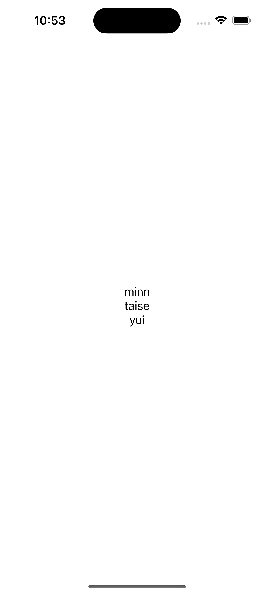
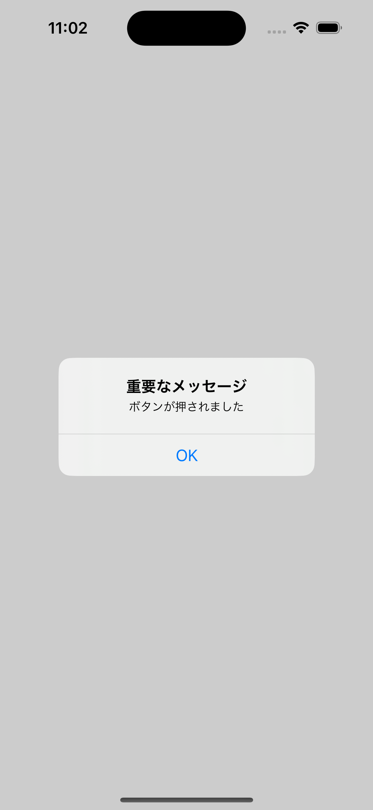
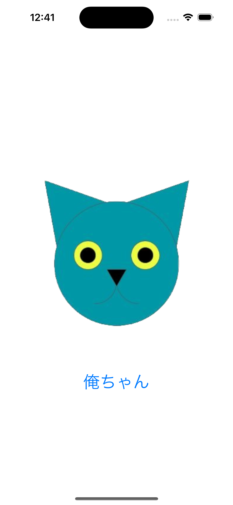
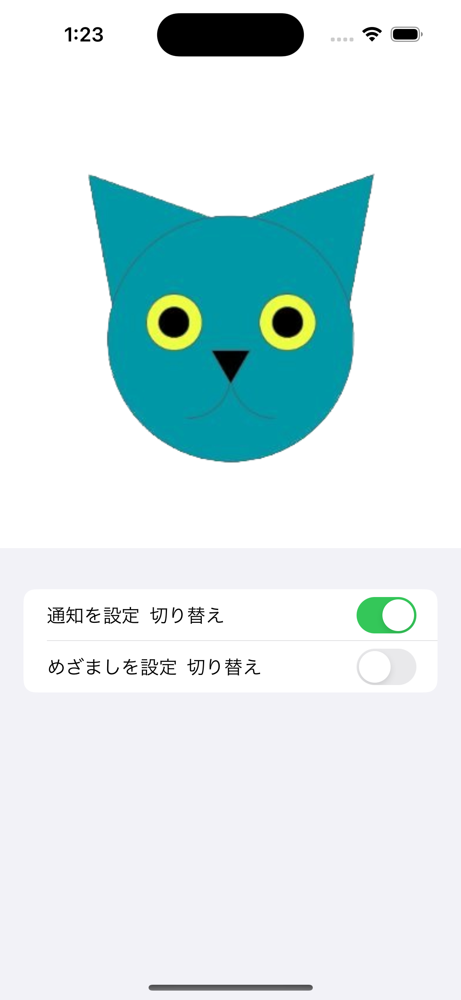
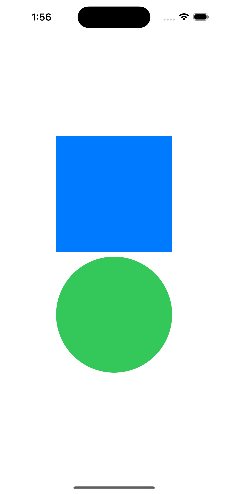

# SwiftUIObject

SwiftUI で色々な Object を使ってみる

[参考にした Zenn の書籍](https://zenn.dev/rikutosato/books/6cee0a2b8aa796/viewer/cb50dd)

## Text を配置する

縦向きに、Text を並べる UI を作成

```swift
import SwiftUI

struct ContentView: View {

    var body: some View {
        VStack {
            Text("minn")
            Text("taise")
            Text("yui")
        }
    }
}

struct ContentView_Previews: PreviewProvider {
    static var previews: some View {
        ContentView()
    }
}
```



## Buttonを配置する
Buttonを配置して、押すとダイアログを出す処理を作ってみました。

```swift
import SwiftUI

struct ContentView: View {
    @State private var showingAlert = false

    var body: some View {
        VStack {
            Button(action: {
                // ボタンを押したときに実行される処理
                // ダイアログを表示する
                self.showingAlert = true
            }, label: {
                Text("ボタン")
            })
            .alert(isPresented: $showingAlert) {
                Alert(title: Text("重要なメッセージ"), message: Text("ボタンが押されました"), dismissButton: .default(Text("OK")))
            }
        }
    }
}

struct ContentView_Previews: PreviewProvider {
    static var previews: some View {
        ContentView()
    }
}
```



## 画像を表示する
x-codeのAssetsに、jpegかpngの画像を配置する。Swiftでは、拡張子なしで画像の名前を指定すると、UIに表示することができる。

```swift
import SwiftUI

struct ContentView: View {
    @State private var showingAlert = false

    var body: some View {
        VStack {
            Image("orechan")
        }
        Text("俺ちゃん")
            .font(.system(size: 30))
            .foregroundColor(.blue)
    }
}

struct ContentView_Previews: PreviewProvider {
    static var previews: some View {
        ContentView()
    }
}
```



## List & Toggleの使い方
Textを上から並べてiPhoneのメニューリストみたいなものを作りたい問いは、Listを使います。

```swift
List {
    Text("アカウント設定")
    Text("wifi")
    Text("ストレージ")
}
```

通知の設定とかを切り替えるボタンは、Toggleを使用します。

```swift
struct ContentView: View {
    @State var isOn = false

    var body: some View {
        Toggle("通知設定", isOn: $isOn)
    }
}
```

組み合わせてこんなUIを作ってみました。

```swift
import SwiftUI

struct ContentView: View {
    @State var notificaton = false
    @State var watch = false

    var body: some View {
        VStack {
            Image("orechan")
        }
        List {
            HStack {
                Text("通知を設定")
                // Toggleを右端に寄せる
                Spacer()
                Toggle("切り替え", isOn: $notificaton)
            }
            HStack {
                Text("めざましを設定")
                // Toggleを右端に寄せる
                Spacer()
                Toggle("切り替え", isOn: $watch)
            }
        }
    }
}

struct ContentView_Previews: PreviewProvider {
    static var previews: some View {
        ContentView()
    }
}
```



## Rectangle & Circle
四角い図形を配置するには、Rectangleを使います。丸い図形を配置するには、Circleを使います。それぞれ、frameでサイズを指定します。

```swift
import SwiftUI

struct ContentView: View {
    @State var notificaton = false
    @State var watch = false

    var body: some View {
        VStack {
            // 四角い図形を配置
            Rectangle()
                .foregroundColor(.blue)
                .frame(width: 200, height: 200)
            // 丸の図形を配置
            Circle()
                .foregroundColor(.green)
                .frame(width: 200, height: 200)
        }
    }
}

struct ContentView_Previews: PreviewProvider {
    static var previews: some View {
        ContentView()
    }
}
```


